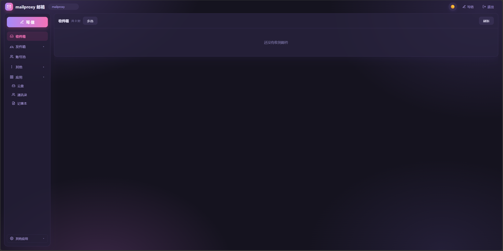

<a id="top"></a>

<p align="center">
  
</p>

<h1 align="center">MailProxy 邮箱</h1>

<p align="center">
  跑在 Cloudflare 免费套餐上的自建邮箱 + 云盘 + 通讯录 + 记事本一体化后台 · 无需 VPS · 不绑卡 · 无限免费 · 难被拦截
</p>

<p align="center">
  <a href="#features">功能特性</a> ·
  <a href="#deploy">部署指南</a> ·
  <a href="#env">环境变量</a> ·
  <a href="#privacy">隐私说明</a> ·
  <a href="#screenshot">截图</a> ·
  <a href="#tech">技术栈</a> ·
  <a href="#structure">项目结构</a> ·
  <a href="#sponsor">赞赏</a>
</p>

<p align="center">
  <sub><i>🌍 语言 / Language: <b>中文</b> | <a href="#english-version">English</a></i></sub>
</p>

---

<p align="center">
  
</p>

---

<a id="intro"></a>

## 🌟 项目简介

MailProxy 是一个跑在 **Cloudflare 免费套餐** 上的自建邮箱后台，同时整合了**云盘、通讯录、记事本**。无需购买 VPS、不绑卡，利用 Cloudflare Workers + D1 免费额度即可拥有专属邮箱系统，对外发信用你的域名身份，对方看不到你的真实邮箱。

### 为什么选择 MailProxy？

- **完全免费** — 无 VPS，Cloudflare Workers / D1 / Email Routing 全免费额度
- **隐私保护** — 发信用你的域名身份，收件人看不到真实邮箱
- **收信不丢** — 原信照常进真实邮箱 + 存库双写，一封不丢
- **一体化** — 邮箱 + 云盘 + 通讯录 + 记事本，一个后台全搞定
- **云盘分享** — 生成分享链接，支持提取码、有效期、下载统计
- **手机适配** — 深浅主题、移动端自适应

<a id="features"></a>

## ✨ 功能特性

| 功能 | 说明 |
|------|------|
| 📥 收件箱 | 双写（原信转发真实邮箱 + 存 D1），实时解析正文、RFC2047 中文主题、真实发件人；多选批量删、软删可恢复、永久删 |
| ✉️ 写邮件 | 任意别名发信、附件（XHR 真实进度、发送中锁定）、存草稿 |
| 📤 已发送 / 草稿箱 | 记录与续编 |
| 🪪 邮箱别名 | 新建 / 删除 / 头像（裁剪 128px）/ 星标 |
| 👥 通讯录 / 重要联系人 | 增删改查 |
| 💾 云盘 | 上传（二进制直传，单文件 ≤25MB）/ 列表 / 改名 / 删 / 预览 / **分享**（提取码 + 有效期 + 下载人数统计） |
| 📝 记事本 | 增删改查 |
| 🔗 其他应用 | 侧栏底部可扩展外链入口（默认空，可在 `frontend/index.html` 的 `otherapps-pop` 中按示例自行添加） |
| 🌗 深浅主题 | 自动跟随系统或手动切换（localStorage 记忆）、手机端自适应 |

<a id="deploy"></a>

## 🚀 部署指南

### 前置条件

- [Cloudflare 账号](https://dash.cloudflare.com/)（免费即可）
- [GitHub 账号](https://github.com/)
- 一个域名（用于 Email Routing 收信与发信身份）
- 发信通道账号（Resend 或 MailChannels，二选一即可）

### 快速部署

1. **克隆本仓库**
   ```bash
   git clone https://github.com/1877510091/mailproxy.git
   cd mailproxy
   ```

2. **在 `wrangler.toml` 填入你自己的资源信息**
   - `account_id`：你的 Cloudflare 账号 ID
   - 两个 D1 的 `database_id`：先建库再回填（见下一步）
   - 自定义域名：在 Cloudflare 面板把你的域名绑定到本 Worker

3. **建两个 D1 库并建表**
   ```bash
   wrangler d1 create mailproxy
   wrangler d1 create drive
   # 把返回的 id 填进 wrangler.toml 的 database_id
   wrangler d1 execute mailproxy --remote --file=./数据库结构.sql
   wrangler d1 execute drive     --remote --file=./数据库结构.sql
   ```

4. **配置密钥（不进代码）**
   ```bash
   wrangler secret put ADMIN_TOKEN      # 后台登录密码
   wrangler secret put QQ_EMAIL         # 收信转发目标真实邮箱
   # 可选：
   wrangler secret put RESEND_API_KEY
   wrangler secret put MAILCHANNELS_API_KEY
   wrangler secret put ADMIN_ACCOUNT    # 登录账号名，默认 admin
   wrangler secret put DOMAIN           # 你的域名
   ```

5. **部署**
   ```bash
   npx wrangler deploy
   ```

6. **配置收信（Cloudflare 面板）**
   - Email Routing → 开启，把你的域名 catch-all 路由到本 Worker
   - 详细步骤见 [部署说明.md](部署说明.md)

### 首次登录

- 访问你的 Worker 域名
- 输入账号（默认 `admin`，可在 `ADMIN_ACCOUNT` 中改）与 `ADMIN_TOKEN` 即进入后台

<a id="env"></a>

## 🔐 环境变量（secret，不进代码）

| 变量 | 必填 | 说明 |
|------|------|------|
| `ADMIN_TOKEN` | ✅ | 后台登录密码（登录后即为内部 token），例 `openssl rand -hex 16` |
| `QQ_EMAIL` | ✅ | 收信转发目标真实邮箱 |
| `ADMIN_ACCOUNT` | ❌ | 登录账号名，默认 `admin`（大小写不敏感） |
| `DOMAIN` | ❌ | 你的域名，用于发信身份与界面展示 |
| `RESEND_API_KEY` | ❌ | 发信通道 1（Resend 免费 100 封/天） |
| `MAILCHANNELS_API_KEY` | ❌ | 发信通道 2（MailChannels Email API） |

<a id="privacy"></a>

## 🛡️ 隐私说明

- 对外发信用你的域名身份，对方看不到真实邮箱。
- 收信双写：原信照常进真实邮箱，同时存库供后台查看，一封不丢。
- ⚠️ MailChannels **严禁营销 / 批量群发**，仅限个人事务性偶发使用；违规会封通道、毁域名信誉。

<a id="screenshot"></a>

## 📸 截图

<p align="center">
  
</p>

<a id="tech"></a>

## 🛠 技术栈

- **前端：** 原生 HTML/CSS/JavaScript（零框架，单文件 SPA）
- **后端：** Cloudflare Workers（边缘计算，`src/后端.js`）
- **数据库：** Cloudflare D1（SQLite，邮件库 `mailproxy` + 云盘库 `drive`）
- **收信：** Cloudflare Email Routing catch-all → Worker 双写
- **发信：** Resend / MailChannels Email API（双通道）
- **部署：** Cloudflare Workers（免费托管）

<a id="structure"></a>

## 📂 项目结构

```
mailproxy/
├── src/
│   └── 后端.js              # Cloudflare Worker 后端（所有 /api 路由 + 收信 + 分享页 + 定时清理）
├── frontend/
│   └── index.html          # 管理后台单页 SPA（与 API 同源，GET / 返回）
├── wrangler.toml           # Worker 配置、D1 绑定、cron、自定义域（占位，需自填）
├── 数据库结构.sql           # 完整建表 DDL（双库，全部 IF NOT EXISTS）
├── 部署说明.md              # 详细部署说明（中文）
├── LICENSE                 # MIT License
└── images/                 # README 用图（图标 / 界面 / 赞赏码）
```

<a id="contribute"></a>

## 🤝 贡献

欢迎提交 Issue 和 Pull Request！

1. Fork 本仓库
2. 创建你的特性分支 (`git checkout -b feature/AmazingFeature`)
3. 提交你的更改 (`git commit -m 'Add some AmazingFeature'`)
4. 推送到分支 (`git push origin feature/AmazingFeature`)
5. 打开一个 Pull Request

<a id="license"></a>

## 📄 License

本项目基于 [MIT License](LICENSE) 开源。

<a id="sponsor"></a>

## 💰 觉得好的话可以点击下边的微信赞赏码给偶打点钱喵~

<p align="center">
  
</p>

<p align="center">谢谢泥喵~ 😺</p>

---

<p align="center">
  如果这个项目对你有帮助，欢迎给个 ⭐ Star 支持一下！
</p>

---

<a id="english-version"></a>

# 🌍 English Version

<p align="center">
  <sub><i>Language: <a href="#top">中文</a> | <b>English</b></i></sub>
</p>

<a id="intro-en"></a>

## 🌟 Introduction

MailProxy is a **self-hosted mail backend** running entirely on the **Cloudflare free tier**, bundling **cloud drive + contacts + notes** into one dashboard. No VPS, no credit card — just Cloudflare Workers + D1 free quota gives you a personal mail system. Outbound mail uses your domain identity, so recipients never see your real mailbox.

### Why MailProxy?

- **Completely Free** — No VPS; Cloudflare Workers / D1 / Email Routing all on free tier
- **Privacy** — Outbound mail carries your domain identity; real mailbox stays hidden
- **No Lost Mail** — Original mail still lands in your real mailbox + stored in D1 (dual-write)
- **All-in-One** — Mail + drive + contacts + notes in a single dashboard
- **Drive Sharing** — Share links with passcode, expiry and download stats
- **Mobile Friendly** — Dark/light theme and responsive design

<a id="features-en"></a>

## ✨ Features

| Feature | Description |
|---------|-------------|
| 📥 Inbox | Dual-write (forward to real mailbox + store in D1), live body parsing, RFC2047 Chinese subject, real sender; multi-select batch delete, soft-delete recoverable, hard delete |
| ✉️ Compose | Send from any alias, attachments (real XHR progress, locked while sending), save drafts |
| 📤 Sent / Drafts | History and resume editing |
| 🪪 Email aliases | Create / delete / avatar (128px crop) / star |
| 👥 Contacts / Important contacts | CRUD |
| 💾 Drive | Upload (raw binary, ≤25MB/file) / list / rename / delete / preview / **share** (passcode + expiry + download count) |
| 📝 Notes | CRUD |
| 🔗 Other Apps | Extensible external-link entry at the bottom of the sidebar (empty by default; add your own in `otherapps-pop` inside `frontend/index.html`) |
| 🌗 Dark/Light theme | Auto-follow system or manual toggle (localStorage), mobile responsive |

<a id="deploy-en"></a>

## 🚀 Deployment Guide

### Prerequisites

- [Cloudflare Account](https://dash.cloudflare.com/) (free tier works)
- [GitHub Account](https://github.com/)
- A domain (for Email Routing inbound and sender identity)
- A send-channel account (Resend or MailChannels, either is fine)

### Quick Deploy

1. **Clone this repo**
   ```bash
   git clone https://github.com/1877510091/mailproxy.git
   cd mailproxy
   ```

2. **Fill your own resources in `wrangler.toml`**
   - `account_id`: your Cloudflare account ID
   - The two D1 `database_id`s: create the databases first, then paste the returned ids
   - Custom domain: bind your domain to this Worker in the Cloudflare dashboard

3. **Create two D1 databases and the tables**
   ```bash
   wrangler d1 create mailproxy
   wrangler d1 create drive
   # paste returned ids into wrangler.toml database_id
   wrangler d1 execute mailproxy --remote --file=./数据库结构.sql
   wrangler d1 execute drive     --remote --file=./数据库结构.sql
   ```

4. **Set secrets (not in code)**
   ```bash
   wrangler secret put ADMIN_TOKEN      # admin login password
   wrangler secret put QQ_EMAIL         # real mailbox for inbound forwarding
   # optional:
   wrangler secret put RESEND_API_KEY
   wrangler secret put MAILCHANNELS_API_KEY
   wrangler secret put ADMIN_ACCOUNT    # login account, default admin
   wrangler secret put DOMAIN           # your domain
   ```

5. **Deploy**
   ```bash
   npx wrangler deploy
   ```

6. **Configure inbound (Cloudflare dashboard)**
   - Email Routing → enable, route your domain catch-all to this Worker
   - Full steps in [部署说明.md](部署说明.md) (Chinese)

### First Login

- Visit your Worker domain
- Enter the account (default `admin`, change via `ADMIN_ACCOUNT`) and `ADMIN_TOKEN` to enter the dashboard

<a id="env-en"></a>

## 🔐 Environment Variables (secrets, not in code)

| Var | Required | Description |
|-----|----------|-------------|
| `ADMIN_TOKEN` | ✅ | Admin login password (also the internal token after login), e.g. `openssl rand -hex 16` |
| `QQ_EMAIL` | ✅ | Real mailbox that inbound mail is forwarded to |
| `ADMIN_ACCOUNT` | ❌ | Login account name, default `admin` (case-insensitive) |
| `DOMAIN` | ❌ | Your domain, used for sender identity and UI |
| `RESEND_API_KEY` | ❌ | Send channel 1 (Resend free 100/day) |
| `MAILCHANNELS_API_KEY` | ❌ | Send channel 2 (MailChannels Email API) |

> This open-source code contains **no real keys / domains / accounts**. All secrets are injected via `wrangler secret` at deploy time — never commit them.

<a id="privacy-en"></a>

## 🛡️ Privacy

- Outbound mail uses your domain identity; recipients never see your real mailbox.
- Inbound is dual-written: the original mail still lands in your real mailbox and is also stored for the dashboard — nothing is lost.
- ⚠️ MailChannels **forbids marketing / bulk sending**; personal transactional use only. Abuse gets channels banned and ruins domain reputation.

<a id="screenshot-en"></a>

## 📸 Screenshot

<p align="center">
  
</p>

<a id="tech-en"></a>

## 🛠 Tech Stack

- **Frontend:** Vanilla HTML/CSS/JavaScript (zero framework, single-file SPA)
- **Backend:** Cloudflare Workers (edge compute, `src/后端.js`)
- **Database:** Cloudflare D1 (SQLite, mail DB `mailproxy` + drive DB `drive`)
- **Inbound:** Cloudflare Email Routing catch-all → Worker dual-write
- **Outbound:** Resend / MailChannels Email API (dual channel)
- **Hosting:** Cloudflare Workers (free)

<a id="structure-en"></a>

## 📂 Project Structure

```
mailproxy/
├── src/
│   └── 后端.js              # Cloudflare Worker backend (all /api routes + inbound + share page + cron)
├── frontend/
│   └── index.html          # Admin dashboard SPA (same-origin with API, served at GET /)
├── wrangler.toml           # Worker config, D1 bindings, cron, custom domain (placeholders, fill yourself)
├── 数据库结构.sql           # Full DDL (both databases, all IF NOT EXISTS)
├── 部署说明.md              # Detailed deploy guide (Chinese)
├── LICENSE                 # MIT License
└── images/                 # README images (icon / UI / sponsor QR)
```

<a id="contribute-en"></a>

## 🤝 Contributing

Issues and Pull Requests are welcome!

1. Fork the repo
2. Create your feature branch (`git checkout -b feature/AmazingFeature`)
3. Commit changes (`git commit -m 'Add some AmazingFeature'`)
4. Push to branch (`git push origin feature/AmazingFeature`)
5. Open a Pull Request

<a id="license-en"></a>

## 📄 License

This project is licensed under the [MIT License](LICENSE).

<a id="sponsor-en"></a>

## 💰 Sponsor

If you find this project helpful, feel free to scan the WeChat sponsor QR code below to buy me a coffee, meow~ Thank you, meow~

<p align="center">
  
</p>

<p align="center">Thank you! 😺</p>

---

<p align="center">
  If this project helps you, please give it a ⭐ Star!
</p>
